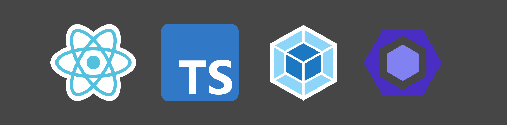

# React-Webpack-Bundler



<h2 align="center">Basic ReactJS Project Bundler</h2>

<p align="center">This project bundler is a ready template for developing react web applications.</p>

<hr />

<h4 align="center">Installation Process</h4>

##### Clone repo:

```bash
git clone https://git.epam.com/azizbek_samatov/reactgmp-netflix-roulette.git
```

##### Install and run:

```bash
npm install
npm run start
```

Build project in production mode:

```bash
npm run build
```

Linting application for checking errors:

```bash
npm run lint
```
